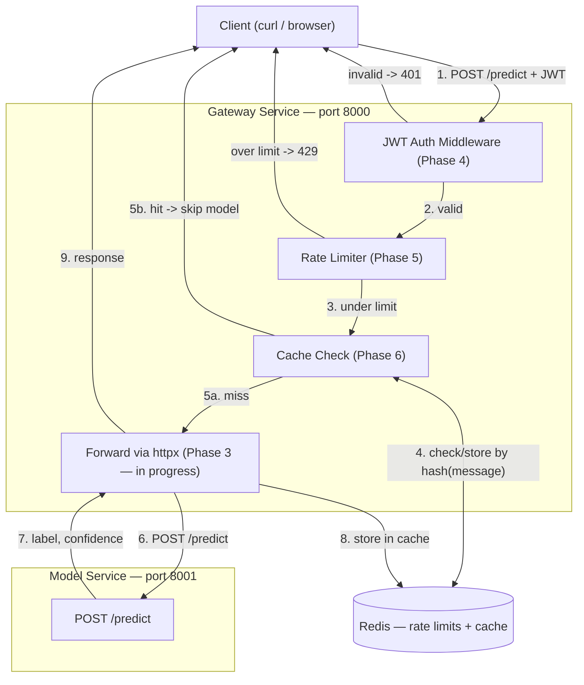

# ML Prediction Gateway — My Notes

## What this project is
A production-style gateway serving my spam/harm classifier through a full backend stack: JWT auth, rate limiting, caching, and Docker deployment. Fills the Docker/infra gap in my resume.

## Tech Stack
- Model service: FastAPI + scikit-learn (CountVectorizer + MultinomialNB)
- Gateway: FastAPI, JWT auth, httpx for service-to-service calls
- Redis: rate limiting + caching
- Docker + docker-compose

## Project Structure
```
ml-prediction-gateway/
│
├── model_service/
│   ├── venv/
│   ├── main.py            # POST /predict — done
│   ├── evaluate.py         # reused notebook metrics instead
│   ├── model.pkl
│   ├── vectorizer.pkl
│   ├── requirements.txt
│   ├── Dockerfile          # done
│   └── .dockerignore       # done
│
├── gateway/
│   ├── venv/
│   ├── main.py             # in progress — httpx forwarding call
│   ├── auth.py              # not started — Phase 4
│   ├── rate_limiter.py      # not started — Phase 5
│   ├── cache.py              # not started — Phase 6
│   ├── requirements.txt
│   └── Dockerfile           # not started
│
├── docker-compose.yml       # not started — Phase 7
├── .env.example              # not started
├── load_test/                # not started — Phase 8
├── docs/
│   └── architecture.md       # <- writing this now
└── README.md                 # not started — Phase 9
```

## System Architecture



## Data Flow (numbered, matches diagram)
1. Client sends POST /predict with JWT
2. Gateway validates JWT -> 401 if invalid
3. Gateway checks Redis rate limit -> 429 if over
4. Gateway hashes message, checks Redis cache
5. Cache hit -> return immediately | Cache miss -> continue
6. Gateway calls model_service via httpx
7. Model service runs vectorizer.transform -> model.predict / predict_proba
8. Gateway stores result in Redis
9. Gateway returns response to client

## Phase Progress

| Phase | Status | Notes |
|---|---|---|
| 1 — Model Service | Done | Tested locally, metrics reused from notebook (94.3% acc, spam f1 0.94) |
| 2 — Dockerize Model Service | Done | Image builds, predictions match local. Known issue: sklearn 1.6.1 (trained) vs 1.9.0 (container) — verified harmless, not yet pinned |
| 3 — Gateway + Routing | Done | venv + FastAPI + httpx set up, PredictRequest schema done, writing the httpx forwarding call now |
| 4 — Auth (JWT) | Not started | |
| 5 — Rate Limiting | Not started | |
| 6 — Caching | Not started | |
| 7 — Full Stack Integration | Not started | docker-compose |
| 8 — Load Testing | Not started | ab/wrk, before/after caching numbers |
| 9 — Polish & Deploy | Not started | README, architecture diagram (this doc feeds it), deploy to Render/Railway |
| 10 — Stretch (Celery) | Not started | only if time allows |

## Known Issues / Decisions Log
- scikit-learn version mismatch (1.6.1 model vs 1.9.0 container) — predictions verified identical, pin later if time allows
- Chose FastAPI over Django for the gateway specifically to learn a new framework
- evaluate.py: decided to reuse notebook's precision/recall/F1 rather than rebuild as a standalone script
- Docker image size: 707MB disk / 201MB content — larger than needed, revisit with multi-stage build in Phase 9 if time allows

## What's next right after finishing the architecture section
1. Finish Phase 3: complete the httpx forwarding call in gateway/main.py (async with httpx.AsyncClient), return the model service's response to the client
2. Test gateway -> model_service end-to-end locally (both running on separate ports, no Docker yet)
3. Phase 4: add JWT middleware to the gateway, reject unauthenticated requests with 401
4. Keep filling in this notes file as each phase closes — it becomes the source material for the real README in Phase 9